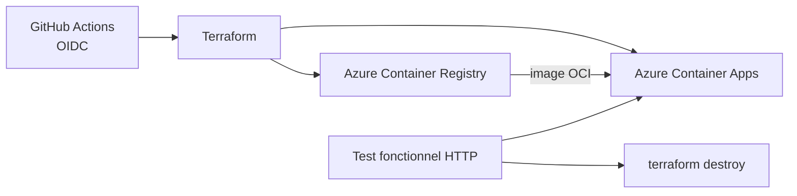

# Azure Ephemeral Container App

Un mini-projet de portfolio qui démontre un cycle CI/CD Azure complet :

1. tests unitaires et construction du conteneur ;
2. authentification GitHub → Azure sans secret grâce à OIDC ;
3. création de l'infrastructure avec Terraform ;
4. publication de l'image dans Azure Container Registry ;
5. déploiement dans Azure Container Apps ;
6. test fonctionnel de l'URL publique ;
7. destruction systématique des ressources éphémères.

L'application est volontairement simple : une API Node.js sans dépendance externe, avec
les routes `/`, `/health` et `/api/info`.

## Architecture



Le groupe de ressources est le seul élément permanent. Il sert de périmètre de sécurité
à l'identité GitHub Actions. Toutes les ressources qu'il contient sont créées puis
détruites à chaque exécution de déploiement.

## Compétences démontrées

- Infrastructure as Code avec Terraform ;
- conteneurisation Docker ;
- Azure Container Apps et Azure Container Registry ;
- registre privé ACR et gestion d'un secret de déploiement éphémère ;
- fédération OIDC GitHub Actions / Microsoft Entra ID ;
- tests unitaires, health check et test fonctionnel avec retry ;
- stratégie de nettoyage avec `if: always()` ;
- principe du moindre privilège grâce à un rôle limité au groupe de ressources.

## Exécution locale

Prérequis : Node.js 22 et Docker.

```bash
npm test
npm start
curl http://localhost:3000/health
docker build -t azure-ephemeral-app .
docker run --rm -p 3000:3000 azure-ephemeral-app
```

## Configuration Azure et GitHub

Le workflow réutilise le groupe de ressources existant
`rg-nathan-tesseyre-prf2026` dans la région `francecentral`. Il ne crée ni groupe de
ressources, ni application Microsoft Entra.

Les trois valeurs suivantes doivent être enregistrées dans **Settings → Secrets and
variables → Actions → Secrets** :

- `AZURE_CLIENT_ID`
- `AZURE_TENANT_ID`
- `AZURE_SUBSCRIPTION_ID`

L'identité correspondante doit déjà disposer d'une fédération OIDC pour le sujet
`repo:NathanTesseyre/azure-ephemeral-container-app:ref:refs/heads/main` et des droits
nécessaires sur le groupe de ressources. Le workflow n'utilise aucun mot de passe
Azure persistant.

Le script `scripts/bootstrap-azure.sh` reste fourni comme exemple autonome, mais il
n'est pas requis pour cet environnement de formation.

## Déclenchement

- une pull request exécute uniquement la CI locale et la validation Terraform ;
- un push sur `main` exécute la CI sans consommer de ressources Azure ;
- `workflow_dispatch` lance manuellement le cycle Azure complet.

Le job Azure est protégé par l'environnement GitHub `azure-demo`. Vous pouvez ajouter
une approbation manuelle dans les règles de cet environnement.

## Coût et nettoyage

Le workflow utilise de petites ressources et les détruit après le test. Azure Container
Registry est facturé tant qu'il existe ; ne supprimez donc pas l'étape de nettoyage.
En cas d'annulation brutale d'un runner, vérifiez le groupe de ressources et supprimez
les ressources restantes avant une nouvelle démonstration.

## Structure

```text
.
├── app/                         # API Node.js
├── infra/
│   ├── platform/                # ACR, environnement, identité et rôle
│   └── application/             # Azure Container App
├── scripts/
│   ├── bootstrap-azure.sh       # configuration OIDC initiale
│   └── functional-test.sh       # test de l'URL déployée
└── .github/workflows/ci-cd.yml
```
